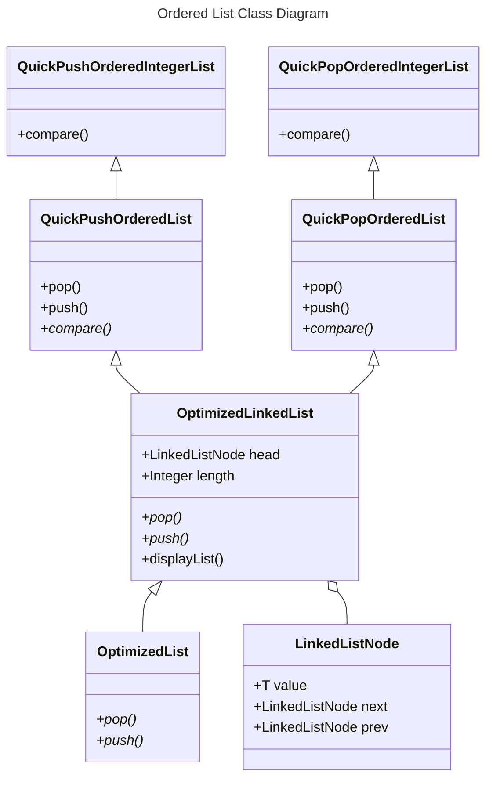

# Ordered-List-Module

## Table of contents
* [General info](#general-info)
* [Technologies](#technologies)
* [Setup](#setup)

## General info
This project contains two Linked Lists that optimally add or remove elements. Both lists accept any type of data as elements. The elements are added/removed in a specified order.
	
## Technologies
Project is created with:
* Java
	
## Setup
To run this project, run the Main class. It contains a console app that allows the user to insert/remove elements. 
It also shows the difference between the running times of the optimized or unoptimized push/pop.

## Features
* QuickPopOrderedList optimally removes elements. The sorting logic is included in the Push method.
* QuickPushOrderedList optimally adds elements. The sorting logic is included in the Pop method.
* Display the content of the lists.
* Display the difference in time between the optimized and unoptimized operations (push/pop).

## Class Diagram

